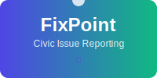
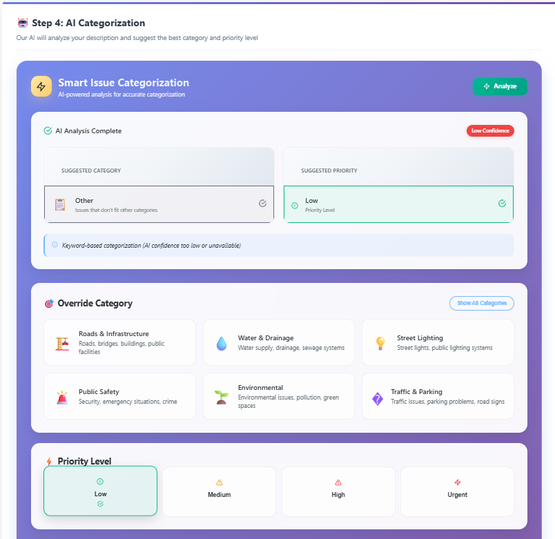

# FixPoint - Civic Issue Reporting Platform



FixPoint is a comprehensive web application that connects citizens with local authorities to report and resolve civic issues in their communities. Built with Spring Boot backend and React frontend, it promotes civic engagement, transparency, and collaborative problem-solving through AI-powered features and real-time communication.

## 🎯 Problem Statement

In many urban and semi-urban neighborhoods, small civic problems such as broken streetlights, potholes, garbage overflow, and stray animals often go unreported and unattended. Citizens are frequently unsure of where to report such problems, or they feel disheartened by the lack of visible response.

**FixPoint addresses this challenge by providing a user-friendly web application that enables residents to report local issues quickly and easily.**

## ✨ Key Features

### For Citizens

- **📱 Issue Reporting**: Submit reports with photos, descriptions, and precise GPS locations
- **🗺️ Interactive Map**: Browse community issues on an interactive map with filtering options
- **📊 Progress Tracking**: Monitor the status of submitted reports with real-time updates
- **💬 Community Engagement**: Vote on issues, add comments, and participate in discussions
- **🤝 Volunteer System**: Opt-in to help resolve local problems and earn certificates
- **🎤 Voice Features**: Voice-to-text and text-to-speech conversion for accessibility
- **🌐 Multi-language Support**: Report in Bangla with automatic English translation

### For Administrators & NGO Staff

- **📋 Dashboard Management**: Access filtered views of reports by area, category, or severity
- **🔄 Status Management**: Update report lifecycle (Submitted → In Progress → Resolved)
- **👥 Assignment System**: Assign reports to teams, contractors, or volunteers
- **📈 Analytics**: Generate statistical reports and visualizations
- **✅ Quality Control**: Validate, merge, or remove duplicate/spam reports
- **📄 PDF Export**: Generate and export detailed reports

### Advanced AI Features

- **🤖 AI-Powered Description Generation**: Automatically generate descriptions from uploaded images
- **🧠 Smart Categorization**: AI suggests issue categories based on photos and descriptions
- **🔍 Duplicate Detection**: Intelligent detection of similar reports to prevent spam
- **⚡ Priority Assessment**: AI determines issue priority based on safety and impact
- **💬 AI Chatbot**: Interactive assistant for civic engagement guidance
- **🔄 Auto-Translation**: Seamless Bangla ↔ English translation

## 🖼️ Feature Screenshots

### 1. Homepage & Authentication


_Clean homepage with role-based authentication (Citizen, Admin, Staff, Volunteer)_


_User registration and login system with role selection_

### 2. Issue Reporting


_Comprehensive report form with image upload, location mapping, and detailed descriptions_

### 3. AI-Powered Features


_AI automatically generates descriptions from images and converts voice to text_


_Smart categorization and priority assessment using AI analysis_

### 4. Interactive Map & Organization


_Interactive map interface with organization dropdown for targeted reporting_

### 5. Additional Features


_Comprehensive report form with image upload, AI description generation, and map integration_


_Real-time map showing all community issues with filtering and status indicators_


_Comprehensive admin panel with report management, analytics, and assignment tools_


_Built-in messaging system for communication between users, admins, and volunteers_


_AI description generation, categorization, and chatbot integration_


_Volunteer registration, task assignment, and certificate generation_

## 🛠️ Technology Stack

### Frontend

- **React.js** (v18.2.0) - UI Framework
- **React Router DOM** (v6.3.0) - Navigation
- **React Hook Form** (v7.45.1) - Form Management
- **Leaflet + React Leaflet** (v4.2.1) - Interactive Maps
- **Axios** (v1.4.0) - HTTP Client
- **React Toastify** (v9.1.3) - Notifications
- **jsPDF** (v3.0.2) - PDF Generation
- **Heroicons & Lucide React** - UI Icons
- **SockJS + STOMP** - WebSocket Communication

### Backend

- **Spring Boot** (v3.5.4) - Main Framework
- **Spring Security** - Authentication & Authorization
- **Spring Data JPA** - Database Abstraction
- **JWT** - Token-based Authentication
- **Spring WebSocket** - Real-time Communication
- **Maven** - Dependency Management
- **Java 17** - Programming Language

### Database & Storage

- **H2 Database** - Primary Database (Development)
- **PostgreSQL/MySQL** - Production Database Options
- **Local File System** - Image Storage (Max 10MB)

### AI & ML Integration

- **LangChain4j** (v0.27.1) - AI Framework
- **Google Gemini 1.5 Flash** - Primary AI Model
- **OpenAI GPT-3.5-turbo** - Backup AI Model
- **Google Cloud Speech-to-Text** - Voice Recognition
- **Web Speech API** - Text-to-Speech

## 🤖 AI Features & Models

### 1. Auto-Generated Text for Images

- **Primary Model**: Google Gemini 1.5 Flash (Vision)
- **Backup Model**: OpenAI GPT-3.5-turbo (Vision-enabled)
- **Framework**: LangChain4j (v0.27.1)
- **Fallback**: Keyword-based text generation

### 2. Voice-to-Text Conversion

- **Primary API**: Google Cloud Speech-to-Text API
- **Model**: latest_long (with punctuation)
- **Audio Format**: WEBM_OPUS, 48kHz
- **Fallback**: Browser-based Web Speech API (offline)

### 3. Text-to-Voice Conversion

- **API**: Web Speech API (SpeechSynthesis)
- **Technology**: Browser-native (works offline)
- **Configurations**: Rate 0.9x, Pitch 1.0, Volume 1.0

### 4. Duplicate Report Detection

- **Algorithm**: Custom similarity detection
- **Methods**: Location-based (Haversine formula), Description similarity, Category matching
- **Threshold**: 5km radius, 7-day window
- **Fallback**: Manual review system

### 5. Multi-Language Support

- **Primary Model**: Google Gemini 1.5 Flash
- **Backup Model**: OpenAI GPT-3.5-turbo
- **Languages**: English ↔ Bangla (Bengali)
- **Fallback**: Keyword-based translation patterns

### 6. AI Categorization

- **Primary Model**: Google Gemini 1.5 Flash (Vision + Text)
- **Categories**: Infrastructure, Utilities, Safety, Environment, Transportation, Healthcare, Education, Social Services, Other
- **Outputs**: Category + Priority + Confidence score + Reasoning
- **Fallback**: Keyword-based categorization

### 7. AI Chatbot

- **Primary Model**: Google Gemini 1.5 Flash
- **Specialization**: Civic engagement + Multi-domain support
- **Features**: Civic issue guidance, Category help, Progress tracking, Community engagement tips
- **Fallback**: Pattern-matching responses

### 8. Priority Detection

- **Primary Model**: Google Gemini 1.5 Flash
- **Priority Levels**: URGENT, HIGH, MEDIUM, LOW
- **Factors**: Public safety risks, Infrastructure damage severity, Number of people affected
- **Fallback**: Keyword-based assessment

## 🚀 Getting Started

### Prerequisites

- Java 17 or higher
- Node.js 16 or higher
- Maven 3.6 or higher

### Backend Setup

1. **Clone the repository**

   ```bash
   git clone <repository-url>
   cd FixPoint
   ```

2. **Configure AI Services** (Optional)
   Edit `src/main/resources/application.properties`:

   ```properties
   # For Google Gemini
   ai.provider=gemini
   gemini.api.key=your_gemini_api_key_here

   # For OpenAI (Backup)
   openai.api.key=your_openai_api_key_here

   # For Google Cloud Speech
   google.cloud.project.id=your_project_id
   google.cloud.credentials.path=path/to/credentials.json
   ```

3. **Run the Spring Boot application**
   ```bash
   ./mvnw spring-boot:run
   ```
   The backend will start on `http://localhost:8080`

### Frontend Setup

1. **Navigate to frontend directory**

   ```bash
   cd frontend
   ```

2. **Install dependencies**

   ```bash
   npm install
   ```

3. **Start the development server**
   ```bash
   npm start
   ```
   The frontend will start on `http://localhost:3000`

### Default Admin User

On first run, create an admin user through the registration form, then update the role in the database:

```sql
UPDATE users SET role = 'ADMIN' WHERE username = 'your-admin-username';
```

## 📱 User Roles & Workflows

### Citizen Workflow

1. **Register/Login** → Create account as Citizen
2. **Report Issue** → Upload photo, add description, mark location
3. **Track Progress** → Monitor status updates and admin responses
4. **Community Engagement** → Vote, comment, and volunteer for issues
5. **Receive Updates** → Get notifications on report progress

### Admin Workflow

1. **Login** → Access admin dashboard
2. **Review Reports** → Filter and manage incoming reports
3. **Assign Tasks** → Delegate to staff or volunteers
4. **Update Status** → Track progress and mark resolution
5. **Generate Reports** → Export analytics and PDF reports

### Staff Workflow

1. **Login** → Access assigned tasks
2. **View Assignments** → See assigned reports and priorities
3. **Update Progress** → Provide status updates and photos
4. **Communicate** → Chat with citizens and admins
5. **Mark Complete** → Submit resolution details

### Volunteer Workflow

1. **Register** → Sign up as volunteer with skills
2. **Browse Opportunities** → Find issues matching skills
3. **Accept Tasks** → Take on volunteer assignments
4. **Complete Work** → Submit progress and photos
5. **Earn Certificates** → Receive recognition for contributions

## 🔧 API Endpoints

### Authentication

- `POST /api/auth/signin` - User login
- `POST /api/auth/signup` - User registration
- `GET /api/auth/check-username` - Check username availability
- `GET /api/auth/check-email` - Check email availability

### Reports

- `GET /api/reports` - Get all reports (authenticated)
- `POST /api/reports` - Create new report
- `GET /api/reports/{id}` - Get report by ID
- `GET /api/reports/my-reports` - Get user's reports
- `GET /api/reports/area` - Get reports in geographical area
- `POST /api/reports/{id}/vote` - Vote for a report
- `PUT /api/reports/{id}/status` - Update report status (admin only)
- `PUT /api/reports/{id}/assign` - Assign report (admin only)

### AI Services

- `POST /api/ai/generate-description` - Generate description from image
- `POST /api/ai/categorize` - AI categorization
- `POST /api/ai/translate` - Multi-language translation
- `POST /api/ai/chat` - AI chatbot interaction
- `POST /api/ai/check-duplicate` - Duplicate detection

### Public Endpoints

- `GET /api/public/reports` - Get public reports
- `GET /api/public/reports/resolved` - Get resolved reports
- `GET /api/public/reports/categories` - Get report categories
- `GET /api/public/reports/statuses` - Get report statuses

## 🗄️ Database Schema

### Users Table

- Basic user information (username, email, password)
- Location data (latitude, longitude, address)
- Role management (CITIZEN, ADMIN, NGO_STAFF, VOLUNTEER)
- Volunteer status and skills

### Reports Table

- Issue details (title, description, category)
- Status tracking (SUBMITTED, IN_PROGRESS, RESOLVED, REJECTED)
- Location data with precise coordinates
- Image attachments and resolution photos
- Priority levels and vote counts
- AI-generated metadata

### Supporting Tables

- Comments for community discussion
- Votes for issue prioritization
- Chat messages for real-time communication
- Volunteer assignments and certificates
- AI analysis results and confidence scores

## 🔒 Security Features

- **JWT Authentication**: Secure token-based authentication
- **Role-based Access Control**: Different permissions for citizens, admins, staff, and volunteers
- **CORS Configuration**: Proper cross-origin resource sharing setup
- **Input Validation**: Comprehensive validation on both frontend and backend
- **File Upload Security**: Secure image upload with size and type restrictions
- **API Rate Limiting**: Protection against abuse and spam

## 🧪 Development

### Running Tests

```bash
# Backend tests
./mvnw test

# Frontend tests
cd frontend
npm test
```

### Building for Production

```bash
# Backend
./mvnw clean package

# Frontend
cd frontend
npm run build
```

### Environment Variables

Create a `.env` file in the frontend directory:

```
REACT_APP_API_URL=http://localhost:8080
REACT_APP_GOOGLE_MAPS_API_KEY=your_maps_api_key
```

## 🚀 Deployment

### Docker (Optional)

```dockerfile
# Backend Dockerfile
FROM openjdk:17-jdk-slim
COPY target/fixpoint-0.0.1-SNAPSHOT.jar app.jar
EXPOSE 8080
ENTRYPOINT ["java","-jar","/app.jar"]
```

### Production Configuration

For production, update `application.properties`:

```properties
spring.profiles.active=prod
spring.datasource.url=${DATABASE_URL}
spring.jpa.hibernate.ddl-auto=validate
jwt.secret=${JWT_SECRET}
ai.provider=${AI_PROVIDER}
```

## 🌟 Live Demo

- **Frontend**: [https://fixpoint-frontend.vercel.app](https://fixpoint-frontend.vercel.app)
- **Backend**: [https://fixpoint-backend.onrender.com](https://fixpoint-backend.onrender.com)
- **Demo Video**: [YouTube Demo](https://youtube.com/watch?v=demo)

## 📊 Project Statistics

- **Total Commits**: 200+
- **Languages**: Java (Backend), JavaScript (Frontend)
- **AI Models**: 8+ integrated features
- **User Roles**: 4 (Citizen, Admin, Staff, Volunteer)
- **Database Tables**: 10+ with relationships
- **API Endpoints**: 30+ RESTful endpoints

## 🤝 Contributing

1. Fork the repository
2. Create a feature branch (`git checkout -b feature/AmazingFeature`)
3. Commit your changes (`git commit -m 'Add some AmazingFeature'`)
4. Push to the branch (`git push origin feature/AmazingFeature`)
5. Open a Pull Request

## 🗺️ Roadmap

- [ ] Mobile application (React Native)
- [ ] Advanced analytics dashboard with ML insights
- [ ] Real-time notifications (Push notifications)
- [ ] Integration with government APIs
- [ ] Offline capability with sync
- [ ] Multi-tenant support for different cities
- [ ] Advanced AI features (predictive analytics, sentiment analysis)
- [ ] Gamification system with rewards and leaderboards

## 📄 License

This project is licensed under the MIT License - see the [LICENSE](LICENSE) file for details.

## 👥 Team

**Team Ambiguous**

- Full-stack development
- AI/ML integration
- UI/UX design
- DevOps and deployment

## 📞 Support

For support and questions:

- Create an issue in the GitHub repository
- Contact the development team
- Check the documentation wiki

## 🙏 Acknowledgments

- OpenStreetMap for map data
- Leaflet for mapping functionality
- Spring Boot and React communities
- Google AI and OpenAI for AI services
- All contributors and beta testers

---

**Built with ❤️ by Team Ambiguous - Connecting Communities, One Issue at a Time**

_"ধরুন, রাতে বাসা থেকে বের হয়ে দেখলেন রাস্তার লাইটটা নষ্ট হয়ে গেছে। বা সকালে হাঁটতে গিয়ে দেখলেন ডাস্টবিন উপচে রাস্তা ভরে গেছে। এমন ছোট ছোট সমস্যা আমাদের চারপাশে রোজই দেখা যায়… কিন্তু প্রশ্ন হলো – আমরা কার কাছে instantly এগুলো বলবো? FixPoint দিয়ে এখন সহজেই রিপোর্ট করুন!"_
