# FixPoint - Civic Issue Reporting Platform

FixPoint is a comprehensive web application that connects citizens with local authorities to report and resolve civic issues in their communities. Built with Spring Boot backend and React frontend, it promotes civic engagement, transparency, and collaborative problem-solving through AI-powered features and real-time communication.

In many urban and semi-urban neighborhoods, small civic problems such as broken streetlights, potholes, garbage overflow, and stray animals often go unreported and unattended. Citizens are frequently unsure of where to report such problems, or they feel disheartened by the lack of visible response.

**FixPoint addresses this challenge by providing a user-friendly web application that enables residents to report local issues quickly and easily.**

## Key Features

### For Citizens

- **Issue Reporting**: Submit reports with photos, descriptions, and precise GPS locations
- **Interactive Map**: Browse community issues on an interactive map with filtering options
- **Progress Tracking**: Monitor the status of submitted reports with real-time updates
- **Community Engagement**: Vote on issues, add comments, and participate in discussions
- **Volunteer System**: Opt-in to help resolve local problems and earn certificates
- **Voice Features**: Voice-to-text and text-to-speech conversion for accessibility
- **Multi-language Support**: Report in Bangla with automatic English translation

### For Administrators & NGO Staff

- **Dashboard Management**: Access filtered views of reports by area, category, or severity
- **Status Management**: Update report lifecycle (Submitted → In Progress → Resolved)
- **Assignment System**: Assign reports to teams, contractors, or volunteers
- **Analytics**: Generate statistical reports and visualizations
- **Quality Control**: Validate, merge, or remove duplicate/spam reports
- **PDF Export**: Generate and export detailed reports

### Advanced AI Features

- **AI-Powered Description Generation**: Automatically generate descriptions from uploaded images
- **Smart Categorization**: AI suggests issue categories based on photos and descriptions
- **Duplicate Detection**: Intelligent detection of similar reports to prevent spam
- **Priority Assessment**: AI determines issue priority based on safety and impact
- **AI Chatbot**: Interactive assistant for civic engagement guidance
- **Auto-Translation**: Seamless Bangla ↔ English translation

## Feature Screenshots

### 1. Homepage

**Welcome to FixPoint - Your Civic Engagement Platform**

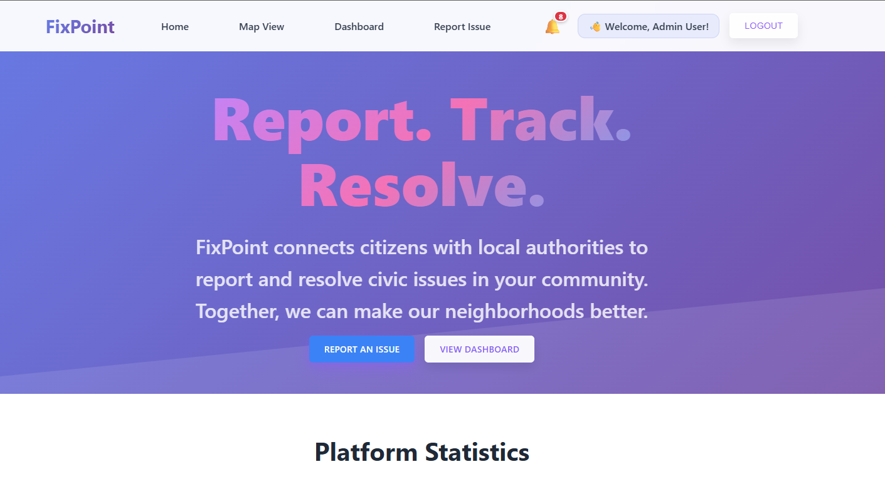
_Clean, modern homepage with role-based authentication for Citizens, Admins, Staff, and Volunteers_


_Seamless user registration and login system with intuitive role selection_

### 2. Reporting Issues

**From Problem to Solution - The Complete Reporting Experience**


_Comprehensive report form with image upload, GPS location mapping, and detailed descriptions_

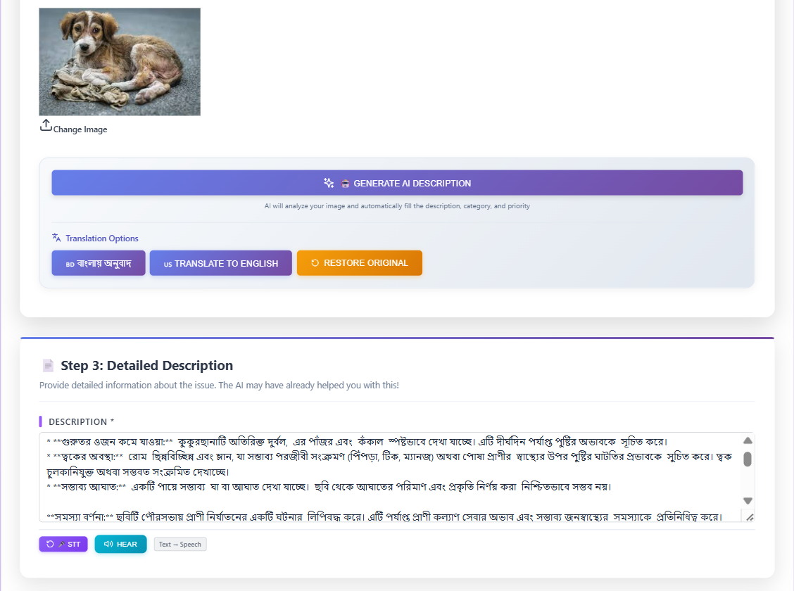
_AI automatically generates descriptions from uploaded images and converts voice to text and vice-versa_


\_Smart categorization and priority assessment using advanced AI analysis*

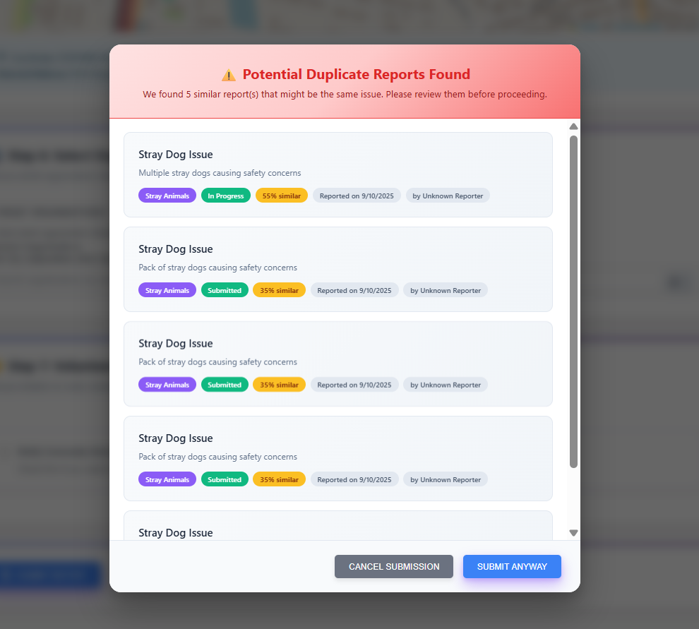
_Intelligent duplicate detection prevents spam and consolidates similar reports_

### 3. Interactive Mapping & Organization

**Visual Problem Tracking and Targeted Reporting**

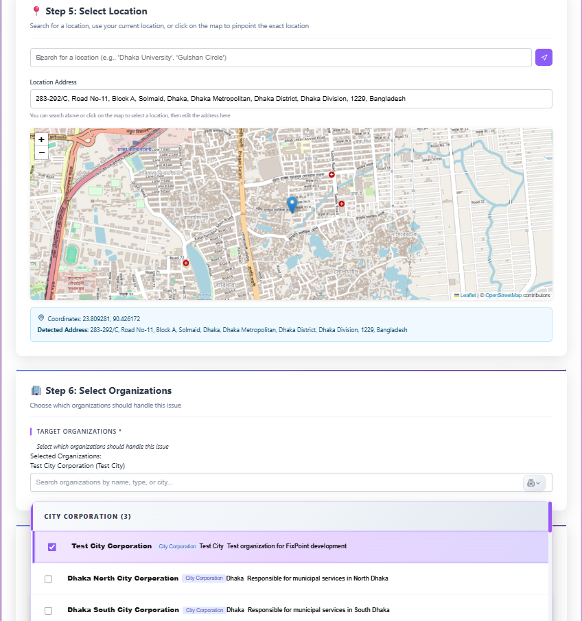
_Interactive map interface with organization dropdown for targeted reporting_

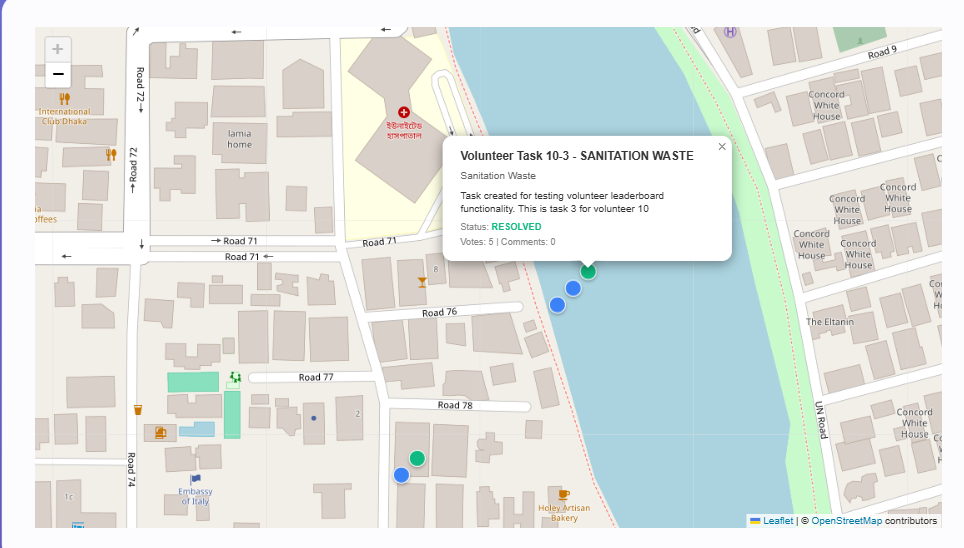
_Real-time map showing all community issues with filtering and status indicators_

### 4. Dashboard & Management

**Comprehensive Control Center for All Users**

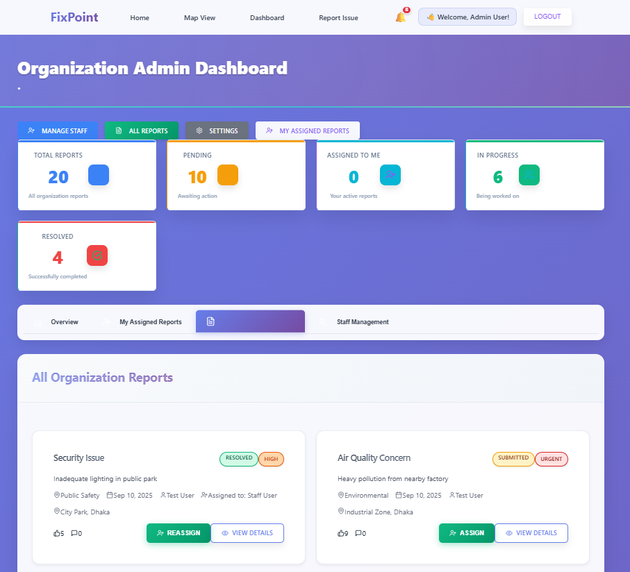
_Unified dashboard providing overview of reports, statistics, and quick actions_

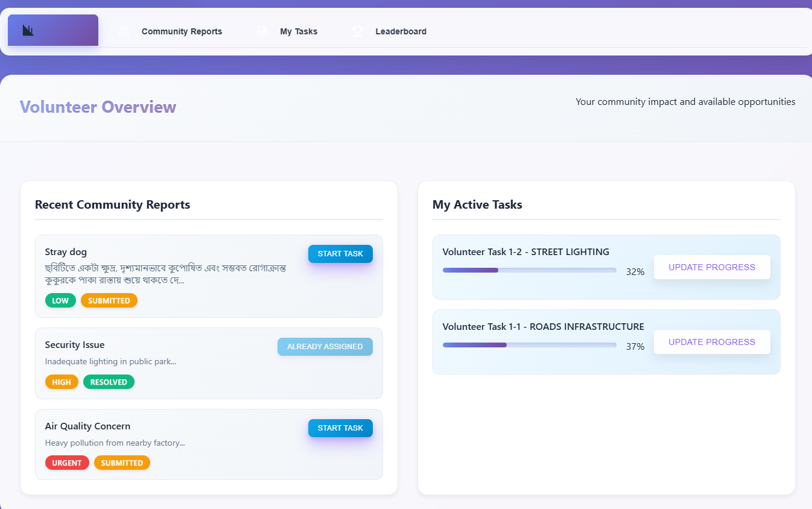
_Detailed reports view with filtering, sorting, and bulk operations_


_Real-time progress tracking and status updates for issue resolution_

### 5. Communication & Collaboration

**Building Community Through Active Engagement**

<div align="center">
  <table>
    <tr>
      <td align="center" width="50%">
        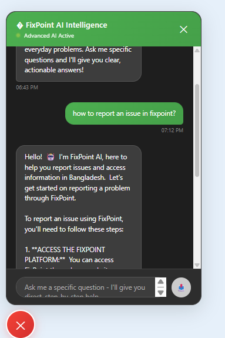
        <br><em>Intelligent AI assistant providing guidance on civic engagement, issue reporting, and community participation</em>
      </td>
      <td align="center" width="50%">
        
        <br><em>Built-in messaging system for seamless communication between users, admins, and volunteers</em>
      </td>
    </tr>
  </table>
</div>

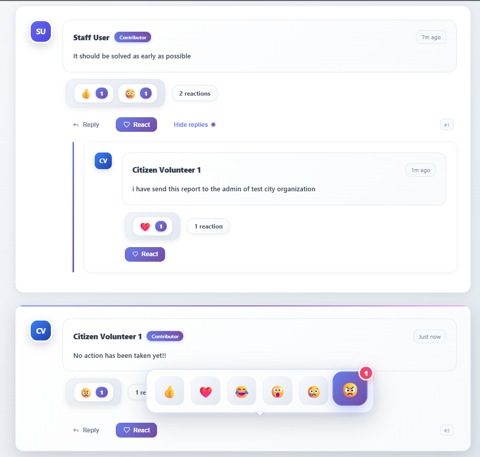
_Community discussion and feedback system for each reported issue_


_Real-time notifications keep users informed about report updates and community activities_

### 6. Recognition & Documentation

**Celebrating Community Contributions**

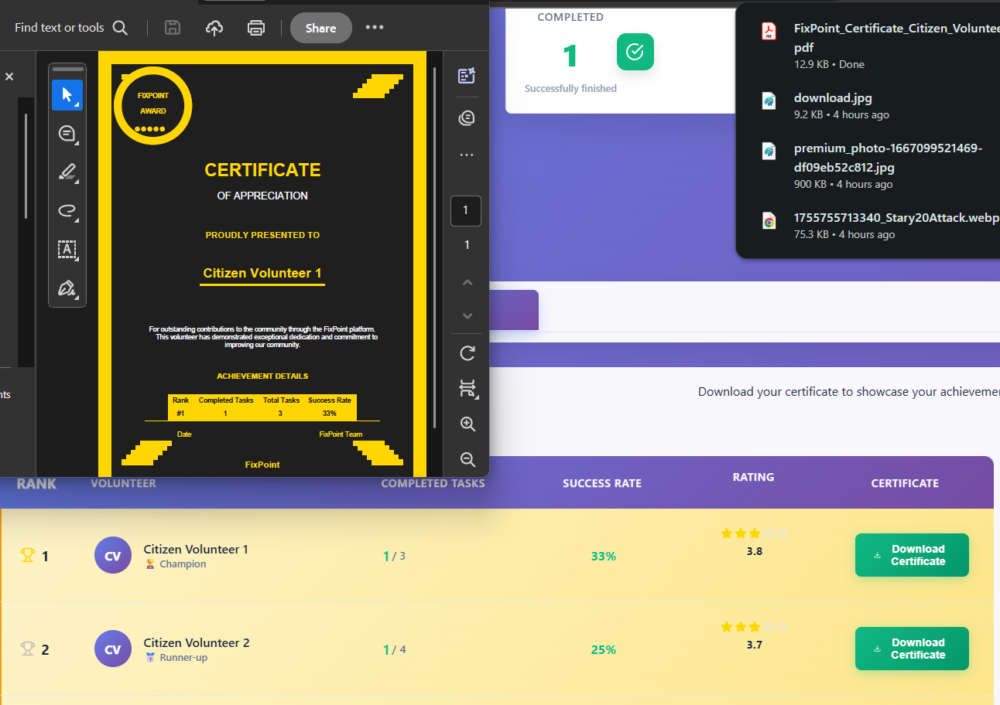
_Automated certificate generation for volunteers and contributors_

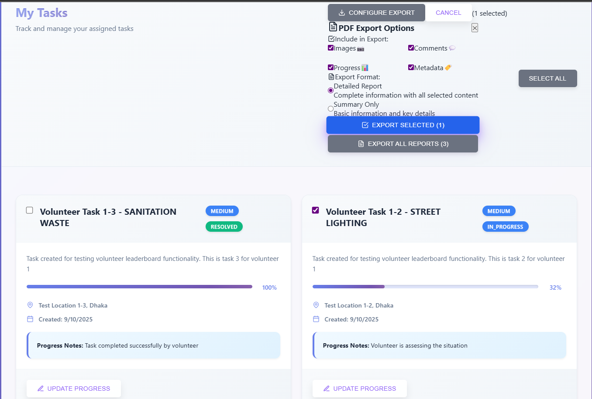
_Professional PDF export functionality for reports and analytics_

## Technology Stack

### Frontend

- **React.js** (v18.2.0) - UI Framework
- **React Router DOM** (v6.3.0) - Navigation
- **React Hook Form** (v7.45.1) - Form Management
- **Leaflet + React Leaflet** (v4.2.1) - Interactive Maps
- **Axios** (v1.4.0) - HTTP Client
- **React Toastify** (v9.1.3) - Notifications
- **jsPDF** (v3.0.2) - PDF Generation
- **Heroicons & Lucide React** - UI Icons
- **SockJS + STOMP** - WebSocket Communication

### Backend

- **Spring Boot** (v3.5.4) - Main Framework
- **Spring Security** - Authentication & Authorization
- **Spring Data JPA** - Database Abstraction
- **JWT** - Token-based Authentication
- **Spring WebSocket** - Real-time Communication
- **Maven** - Dependency Management
- **Java 17** - Programming Language

### Database & Storage

- **H2 Database** - Primary Database (Development)
- **PostgreSQL/MySQL** - Production Database Options
- **Local File System** - Image Storage (Max 10MB)


## Getting Started

### Prerequisites

- Java 17 or higher
- Node.js 16 or higher
- Maven 3.6 or higher

### Backend Setup

1. **Clone the repository**

   ```bash
   git clone <repository-url>
   cd FixPoint
   ```

2. **Configure AI Services** (Optional)
   Edit `src/main/resources/application.properties`:

   ```properties
   # For Google Gemini
   ai.provider=gemini
   gemini.api.key=your_gemini_api_key_here

   # For OpenAI (Backup)
   openai.api.key=your_openai_api_key_here

   # For Google Cloud Speech
   google.cloud.project.id=your_project_id
   google.cloud.credentials.path=path/to/credentials.json
   ```

3. **Run the Spring Boot application**
   ```bash
   ./mvnw spring-boot:run
   ```
   The backend will start on `http://localhost:8080`

### Frontend Setup

1. **Navigate to frontend directory**

   ```bash
   cd frontend
   ```

2. **Install dependencies**

   ```bash
   npm install
   ```

3. **Start the development server**
   ```bash
   npm start
   ```
   The frontend will start on `http://localhost:3000`

### Default Admin User

On first run, create an admin user through the registration form, then update the role in the database:

```sql
UPDATE users SET role = 'ADMIN' WHERE username = 'your-admin-username';
```


### Building for Production

```bash
# Backend
./mvnw clean package

# Frontend
cd frontend
npm run build
```

### Environment Variables

Create a `.env` file in the frontend directory:

```
REACT_APP_API_URL=http://localhost:8080
REACT_APP_GOOGLE_MAPS_API_KEY=your_maps_api_key
```

## 🚀 Deployment

### Docker (Optional)

```dockerfile
# Backend Dockerfile
FROM openjdk:17-jdk-slim
COPY target/fixpoint-0.0.1-SNAPSHOT.jar app.jar
EXPOSE 8080
ENTRYPOINT ["java","-jar","/app.jar"]
```

### Production Configuration

For production, update `application.properties`:

```properties
spring.profiles.active=prod
spring.datasource.url=${DATABASE_URL}
spring.jpa.hibernate.ddl-auto=validate
jwt.secret=${JWT_SECRET}
ai.provider=${AI_PROVIDER}
```

## 🌟 Live Demo

- **Frontend**: [https://fixpoint-frontend.vercel.app](https://fixpoint-frontend.vercel.app)
- **Backend**: [https://fixpoint-backend.onrender.com](https://fixpoint-backend.onrender.com)
- **Demo Video**: [YouTube Demo](https://youtube.com/watch?v=demo)

## 📊 Project Statistics

- **Total Commits**: 200+
- **Languages**: Java (Backend), JavaScript (Frontend)
- **AI Models**: 8+ integrated features
- **User Roles**: 4 (Citizen, Admin, Staff, Volunteer)
- **Database Tables**: 10+ with relationships
- **API Endpoints**: 30+ RESTful endpoints

## 🤝 Contributing

1. Fork the repository
2. Create a feature branch (`git checkout -b feature/AmazingFeature`)
3. Commit your changes (`git commit -m 'Add some AmazingFeature'`)
4. Push to the branch (`git push origin feature/AmazingFeature`)
5. Open a Pull Request

## 🗺️ Roadmap

- [ ] Mobile application (React Native)
- [ ] Advanced analytics dashboard with ML insights
- [ ] Real-time notifications (Push notifications)
- [ ] Integration with government APIs
- [ ] Offline capability with sync
- [ ] Multi-tenant support for different cities
- [ ] Advanced AI features (predictive analytics, sentiment analysis)
- [ ] Gamification system with rewards and leaderboards

## 📄 License

This project is licensed under the MIT License - see the [LICENSE](LICENSE) file for details.

## 👥 Team

**Team Ambiguous**

- Full-stack development
- AI/ML integration
- UI/UX design
- DevOps and deployment

## 📞 Support

For support and questions:

- Create an issue in the GitHub repository
- Contact the development team
- Check the documentation wiki

## 🙏 Acknowledgments

- OpenStreetMap for map data
- Leaflet for mapping functionality
- Spring Boot and React communities
- Google AI and OpenAI for AI services
- All contributors and beta testers

---

**Built with ❤️ by Team Ambiguous - Connecting Communities, One Issue at a Time**

_"ধরুন, রাতে বাসা থেকে বের হয়ে দেখলেন রাস্তার লাইটটা নষ্ট হয়ে গেছে। বা সকালে হাঁটতে গিয়ে দেখলেন ডাস্টবিন উপচে রাস্তা ভরে গেছে। এমন ছোট ছোট সমস্যা আমাদের চারপাশে রোজই দেখা যায়… কিন্তু প্রশ্ন হলো – আমরা কার কাছে instantly এগুলো বলবো? FixPoint দিয়ে এখন সহজেই রিপোর্ট করুন!"_
