# FixPoint Features & Screenshots

## Homepage & Authentication

**Welcome to FixPoint - Your Civic Engagement Platform**

_Clean, modern homepage with role-based authentication for Citizens, Admins, Staff, and Volunteers_

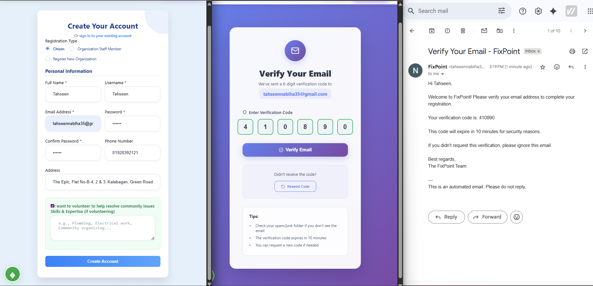
_Seamless user registration and login system with intuitive role selection_

## Issue Reporting

**From Problem to Solution - The Complete Reporting Experience**

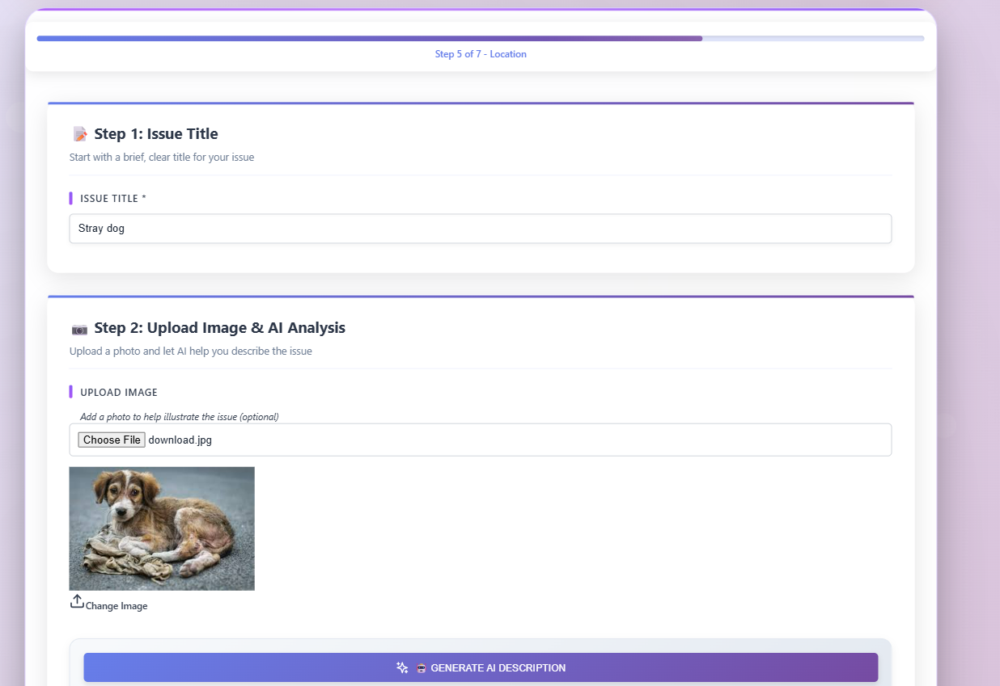
_Comprehensive report form with image upload, GPS location mapping, and detailed descriptions_

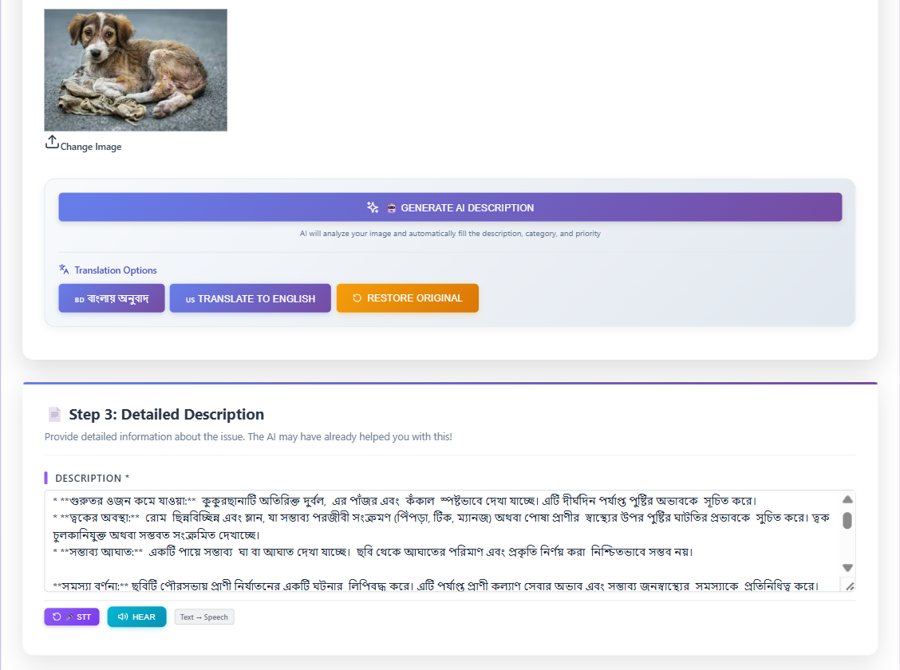
_AI automatically generates descriptions from uploaded images and converts voice to text and vice-versa_

\_Smart categorization and priority assessment using advanced AI analysis*

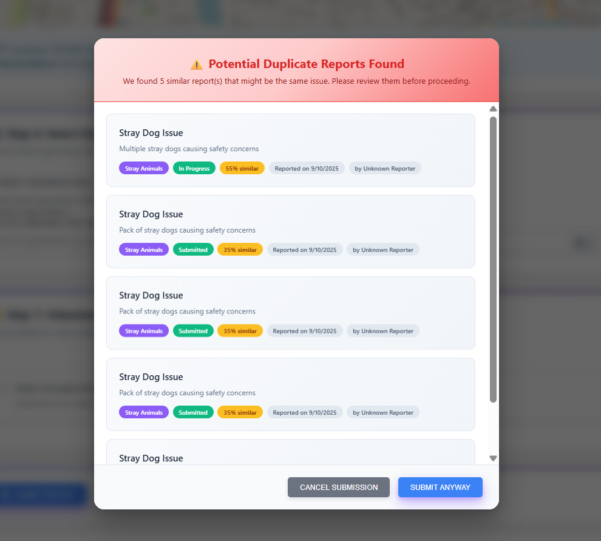
_Intelligent duplicate detection prevents spam and consolidates similar reports_

## Interactive Mapping & Organization

**Visual Problem Tracking and Targeted Reporting**

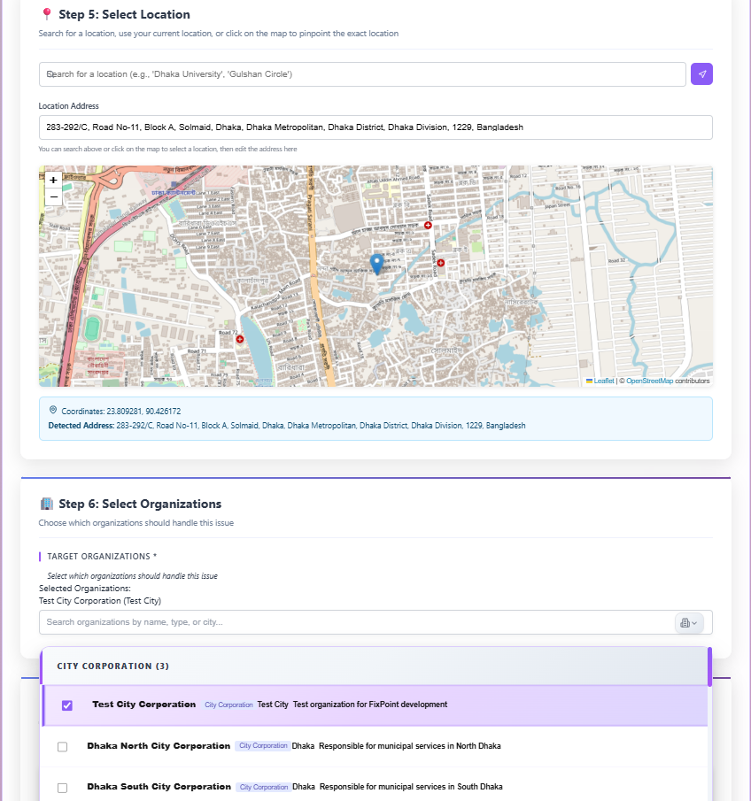
_Interactive map interface with organization dropdown for targeted reporting_

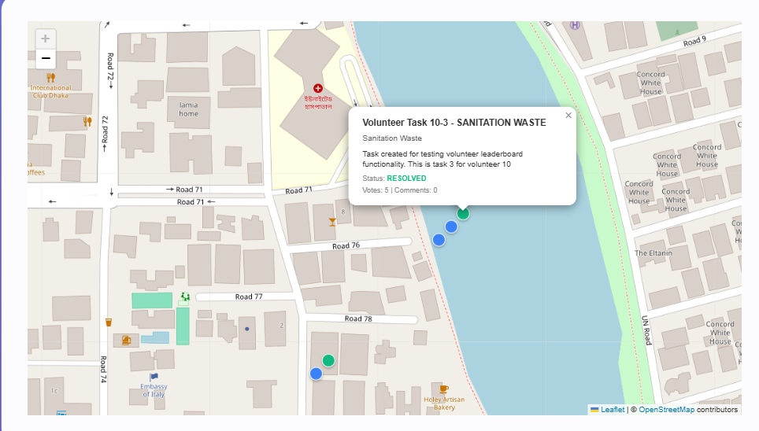
_Real-time map showing all community issues with filtering and status indicators_

## Dashboard & Management

**Comprehensive Control Center for All Users**

_Unified dashboard providing overview of reports, statistics, and quick actions_

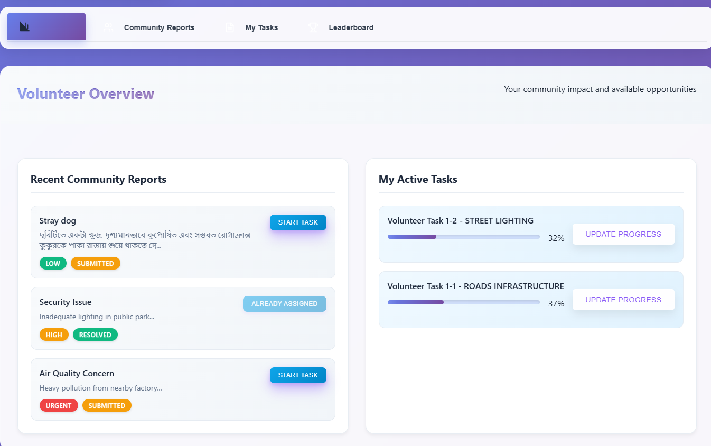
_Detailed reports view with filtering, sorting, and bulk operations_

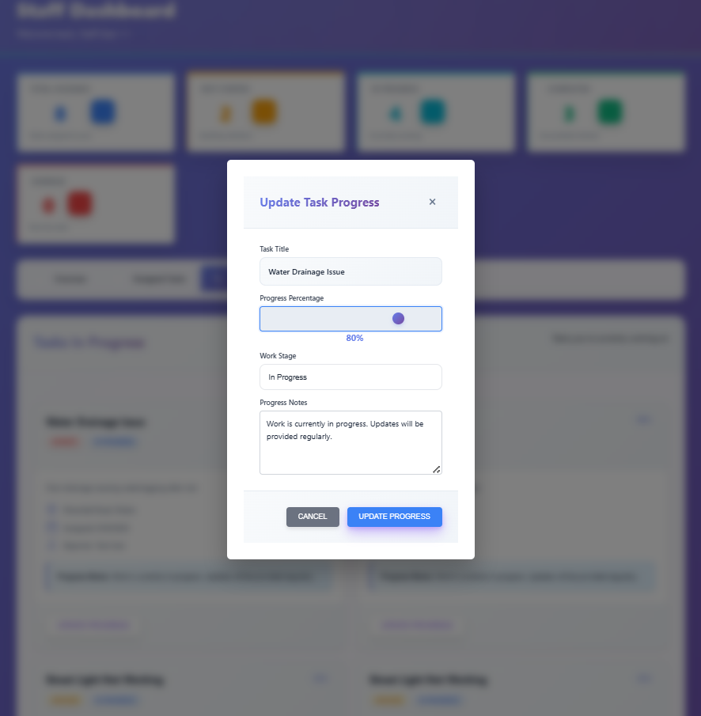
_Real-time progress tracking and status updates for issue resolution_

## Communication & Collaboration

**Building Community Through Active Engagement**

  <table>
    <tr>
      <td align="center" width="50%">
        
         <em>Intelligent AI assistant providing guidance on civic engagement, issue reporting, and community participation</em>
      </td>
      <td align="center" width="50%">
        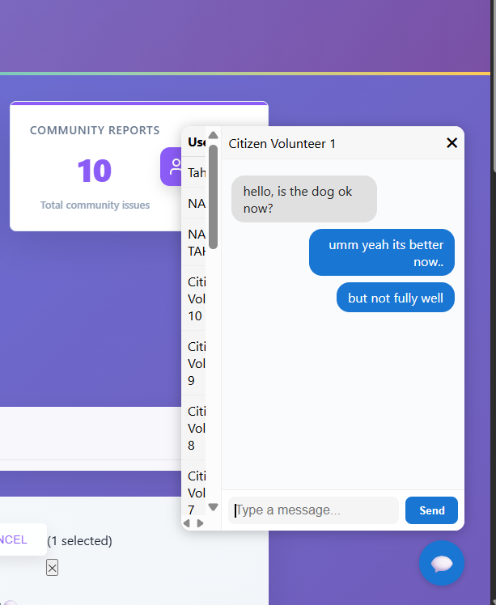
         <em>Built-in messaging system for seamless communication between users, admins, and volunteers</em>
      </td>
    </tr>
  </table>

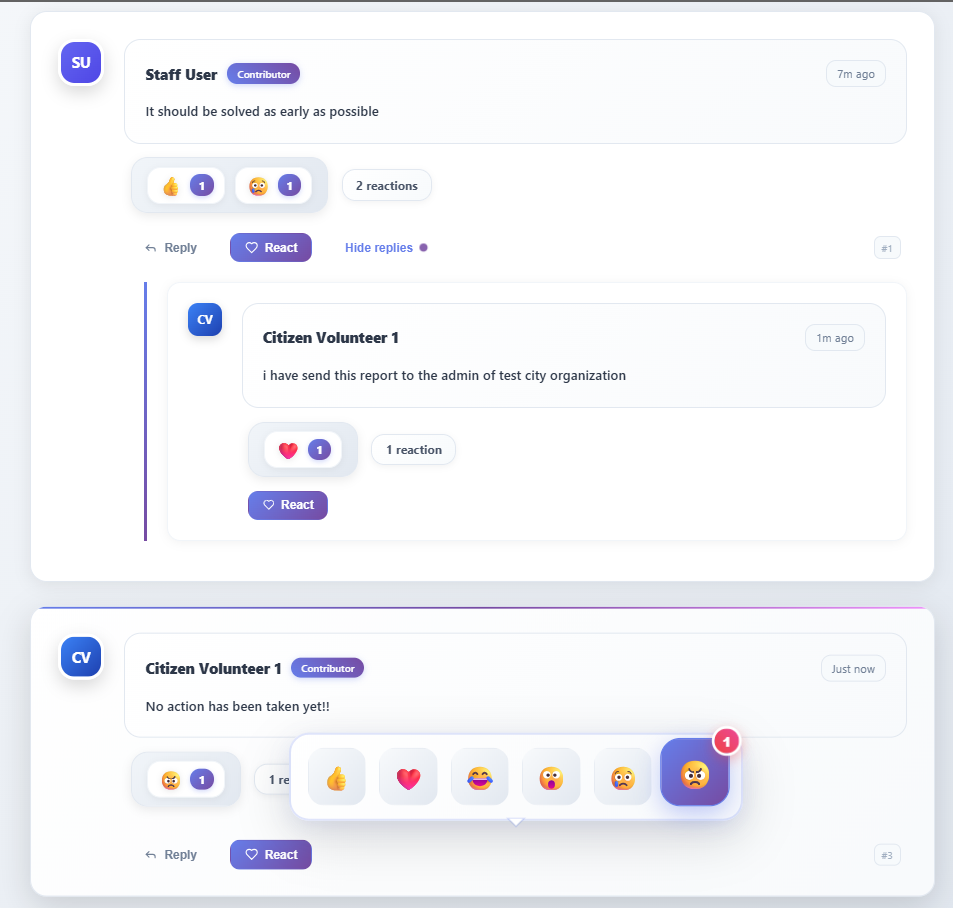
_Community discussion and feedback system for each reported issue_

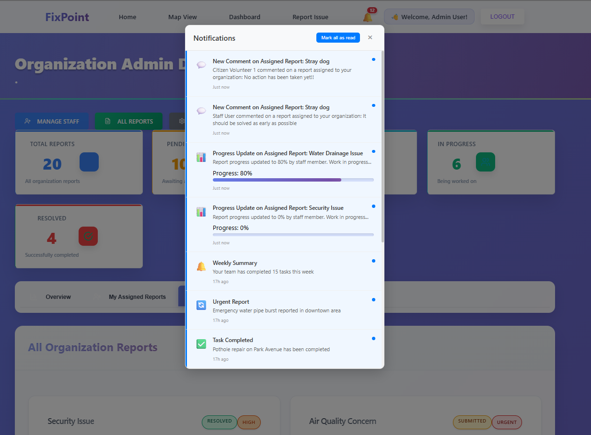
_Real-time notifications keep users informed about report updates and community activities_

## Recognition & Documentation

**Celebrating Community Contributions**

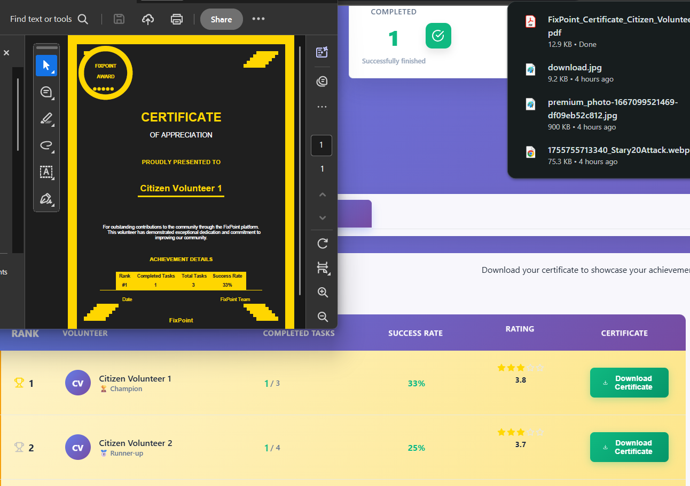
_Automated certificate generation for volunteers and contributors_

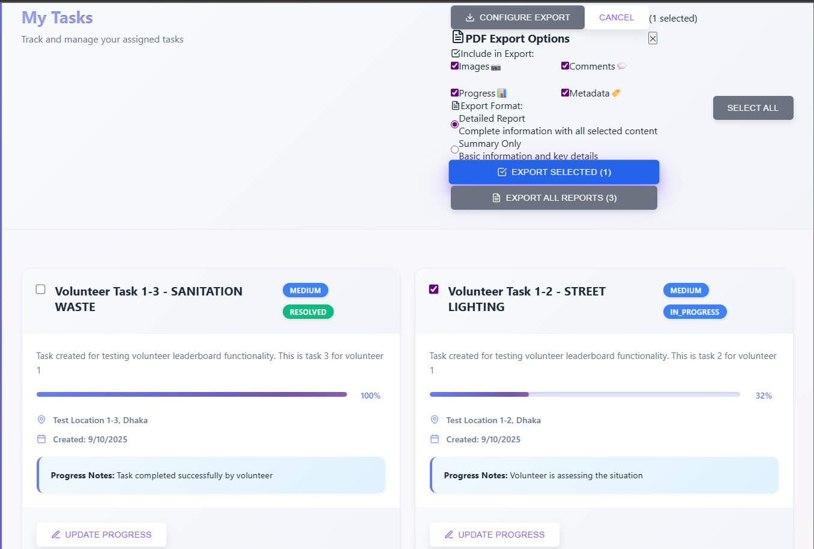
_Professional PDF export functionality for reports and analytics_

## Key Features Overview

### For Citizens

- **Issue Reporting**: Submit reports with photos, descriptions, and precise GPS locations
- **Interactive Map**: Browse community issues on an interactive map with filtering options
- **Progress Tracking**: Monitor the status of submitted reports with real-time updates
- **Community Engagement**: Vote on issues, add comments, and participate in discussions
- **Volunteer System**: Opt-in to help resolve local problems and earn certificates
- **Voice Features**: Voice-to-text and text-to-speech conversion for accessibility
- **Multi-language Support**: Report in Bangla with automatic English translation

### For Administrators & NGO Staff

- **Dashboard Management**: Access filtered views of reports by area, category, or severity
- **Status Management**: Update report lifecycle (Submitted → In Progress → Resolved)
- **Assignment System**: Assign reports to teams, contractors, or volunteers
- **Analytics**: Generate statistical reports and visualizations
- **Quality Control**: Validate, merge, or remove duplicate/spam reports
- **PDF Export**: Generate and export detailed reports

### Advanced AI Features

- **AI-Powered Description Generation**: Automatically generate descriptions from uploaded images
- **Smart Categorization**: AI suggests issue categories based on photos and descriptions
- **Duplicate Detection**: Intelligent detection of similar reports to prevent spam
- **Priority Assessment**: AI determines issue priority based on safety and impact
- **AI Chatbot**: Interactive assistant for civic engagement guidance
- **Auto-Translation**: Seamless Bangla ↔ English translation

## Technology Stack

### Frontend

- **React.js** (v18.2.0) - UI Framework
- **React Router DOM** (v6.3.0) - Navigation
- **React Hook Form** (v7.45.1) - Form Management
- **Leaflet + React Leaflet** (v4.2.1) - Interactive Maps
- **Axios** (v1.4.0) - HTTP Client
- **React Toastify** (v9.1.3) - Notifications
- **jsPDF** (v3.0.2) - PDF Generation
- **Heroicons & Lucide React** - UI Icons
- **SockJS + STOMP** - WebSocket Communication

### Backend

- **Spring Boot** (v3.5.4) - Main Framework
- **Spring Security** - Authentication & Authorization
- **Spring Data JPA** - Database Abstraction
- **JWT** - Token-based Authentication
- **Spring WebSocket** - Real-time Communication
- **Maven** - Dependency Management
- **Java 17** - Programming Language

### Database & Storage

- **H2 Database** - Primary Database (Development)
- **PostgreSQL/MySQL** - Production Database Options
- **Local File System** - Image Storage (Max 10MB)

---

**Built by Team Ambiguous - Connecting Communities, One Issue at a Time**
